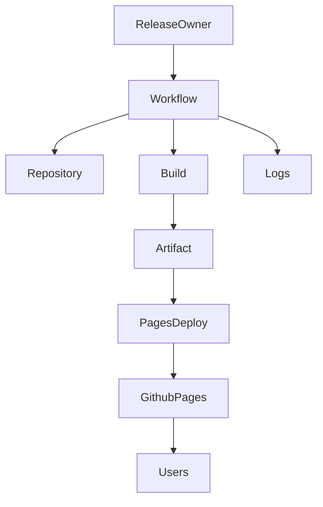
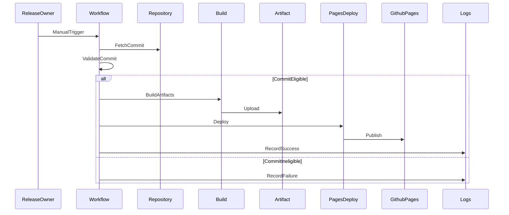

# Technical Design

## Overview
**Purpose**: 本機能は、広辞苑かるたリーダーの静的成果物を GitHub Pages へ任意タイミングで公開できるようにする。
**Users**: リリース担当者が main ブランチにマージ済みの commit を指定してデプロイを実行し、利用者が公開 URL からアクセスする。
**Impact**: デプロイは GitHub Actions のカスタムワークフローに集約し、公開履歴と成否の記録を GitHub 上に残す。

### Goals
- main ブランチにマージ済み commit に対する任意デプロイを実現する
- GitHub Pages で安定した公開 URL を提供する
- デプロイの成否と失敗理由を追跡可能にする

### Non-Goals
- 専用のデプロイ UI の構築
- 外部 DB へのデプロイ履歴の保存
- サーバーサイド処理や API の追加

## Requirements Traceability

| Requirement | Summary | Components | Interfaces | Flows |
|-------------|---------|------------|------------|-------|
| 1.1 | main マージ済み commit の任意デプロイ受付 | WorkflowTrigger, CommitEligibilityGate | Event, Service | DeployFlow |
| 1.2 | main 非マージ commit の拒否と記録 | CommitEligibilityGate, DeploymentRecords | Service, State | DeployFlow |
| 1.3 | 公開対象の識別情報記録 | DeploymentRecords | State | DeployFlow |
| 1.4 | GitHub Actions 上でのデプロイ実行 | WorkflowTrigger, PagesDeployment | Event, Batch | DeployFlow |
| 2.1 | 成果物を GitHub Pages に公開 | PagesDeployment | Batch | DeployFlow |
| 2.2 | 公開 URL の安定提供 | PagesHosting | External | DeployFlow |
| 2.3 | 最新成果物への更新 | PagesDeployment | Batch | DeployFlow |
| 3.1 | 静的成果物一式の公開対象化 | BuildAndArtifact | Batch | DeployFlow |
| 3.2 | 配信パス整合の維持 | BuildAndArtifact, SpaRoutingFallback | Batch | DeployFlow |
| 3.3 | 静的リソース失敗の記録 | DeploymentRecords | State | DeployFlow |
| 4.1 | 直接アクセスの許容 | SpaRoutingFallback, PagesHosting | Batch | DeployFlow |
| 4.2 | 未定義パス時のアプリ側表示許容 | SpaRoutingFallback | Batch | DeployFlow |
| 5.1 | デプロイ開始状態の記録 | DeploymentRecords | State | DeployFlow |
| 5.2 | 失敗理由の記録 | DeploymentRecords | State | DeployFlow |
| 5.3 | 成否の記録 | DeploymentRecords | State | DeployFlow |

## Architecture

### Architecture Pattern & Boundary Map

**Architecture Integration**:
- Selected pattern: CI 駆動のデプロイパイプライン。要件に合わせて GitHub Actions で検証とデプロイを統合する。
- Domain/feature boundaries: リポジトリ内のビルド成果物生成と GitHub Pages への公開を明確に分離する。
- Existing patterns preserved: SPA 静的配信、サーバー不要の方針を維持。
- New components rationale: commit 検証とデプロイ記録を明確に分離し、要件の可観測性を担保する。
- Steering compliance: React SPA と静的配信を前提にした構成を踏襲。



## Technology Stack & Alignment

| Layer | Choice / Version | Role in Feature | Notes |
|-------|------------------|-----------------|-------|
| CI/CD | GitHub Actions | ワークフロー実行基盤 | 手動トリガーとデプロイ制御に使用 |
| CI/CD | actions/checkout@v5 | ソース取得 | リポジトリの内容取得 |
| CI/CD | actions/configure-pages@v5 | Pages 事前設定 | Pages デプロイ準備 |
| CI/CD | actions/upload-pages-artifact@v4 | 成果物登録 | 静的成果物のアップロード |
| CI/CD | actions/deploy-pages@v4 | Pages デプロイ | 公開先への反映 |
| Hosting | GitHub Pages | 静的配信 | 公開 URL を提供 |
| Observability | GitHub Actions Run | 実行履歴 | 成否と失敗理由の記録 |

## System Flows



## Components and Interfaces

| Component | Domain/Layer | Intent | Req Coverage | Key Dependencies (P0/P1) | Contracts |
|-----------|--------------|--------|--------------|--------------------------|-----------|
| WorkflowTrigger | CI/CD | 手動トリガーの受付と入力整形 | 1.1, 1.4 | GitHub Actions (P0) | Event |
| CommitEligibilityGate | CI/CD | commit が main に含まれるか検証 | 1.1, 1.2 | Repository (P0) | Service |
| BuildAndArtifact | CI/CD | 静的成果物の生成と登録 | 3.1, 3.2 | Build Tooling (P0) | Batch |
| PagesDeployment | CI/CD | Pages への公開と更新 | 1.4, 2.1, 2.3 | GitHub Pages (P0) | Batch |
| SpaRoutingFallback | CI/CD | SPA 直リンク互換の成果物整備 | 4.1, 4.2 | BuildAndArtifact (P1) | Batch |
| DeploymentRecords | Observability | デプロイ状態と失敗理由の記録 | 1.3, 3.3, 5.1, 5.2, 5.3 | GitHub Actions Run (P0) | State |
| PagesHosting | Hosting | 公開 URL と配信 | 2.2 | GitHub Pages (P0) | External |

### CI/CD

#### WorkflowTrigger

| Field | Detail |
|-------|--------|
| Intent | main マージ済み commit を対象にしたデプロイ要求を受け付ける |
| Requirements | 1.1, 1.4 |

**Responsibilities & Constraints**
- 手動実行の入力に commit 識別子を含める
- 以降の検証とデプロイは Workflow 内の責務に限定する

**Dependencies**
- Outbound: CommitEligibilityGate — commit 検証 (P0)

**Contracts**: Service [ ] / API [ ] / Event [x] / Batch [ ] / State [ ]

##### Event Contract
- Trigger: 手動実行
- Input: 対象 commit 識別子
- Ordering / delivery guarantees: 同一入力は独立実行

**Implementation Notes**
- Integration: GitHub Actions の手動実行に紐付ける
- Validation: 入力形式は commit 識別子に限定
- Risks: 入力不足時の無効デプロイ

#### CommitEligibilityGate

| Field | Detail |
|-------|--------|
| Intent | 指定 commit が main ブランチに含まれるか判定する |
| Requirements | 1.1, 1.2 |

**Responsibilities & Constraints**
- main ブランチの祖先判定を行う
- 判定結果と理由を返却する

**Dependencies**
- Inbound: WorkflowTrigger — デプロイ要求 (P0)
- Outbound: Repository — commit 参照 (P0)

**Contracts**: Service [x] / API [ ] / Event [ ] / Batch [ ] / State [ ]

##### Service Interface
```typescript
type CommitEligibilityReason = "NotOnMain" | "UnknownCommit" | "InputMissing";

interface CommitEligibilityRequest {
  commitSha: string;
}

interface CommitEligibilityResult {
  eligible: boolean;
  reason?: CommitEligibilityReason;
}

interface CommitEligibilityService {
  evaluate(input: CommitEligibilityRequest): CommitEligibilityResult;
}
```
- Preconditions: commitSha は 7 文字以上の識別子
- Postconditions: eligible が false の場合は reason を返す
- Invariants: main 以外の commit は常に false

**Implementation Notes**
- Integration: main の祖先判定により適格性を判断
- Validation: commitSha の存在と形式
- Risks: shallow fetch による判定失敗

#### BuildAndArtifact

| Field | Detail |
|-------|--------|
| Intent | 静的成果物を生成し Pages 用の成果物として登録する |
| Requirements | 3.1, 3.2 |

**Responsibilities & Constraints**
- SPA の静的成果物を一式で生成
- 配信パスを GitHub Pages に適合させる

**Dependencies**
- Inbound: CommitEligibilityGate — 適格判定 (P0)
- Outbound: PagesDeployment — 成果物提供 (P0)

**Contracts**: Service [ ] / API [ ] / Event [ ] / Batch [x] / State [ ]

##### Batch / Job Contract
- Trigger: CommitEligibilityGate の適格判定後
- Input / validation: 対象 commit のソース
- Output / destination: Pages 向け成果物
- Idempotency & recovery: 同一 commit は同一成果物

**Implementation Notes**
- Integration: 静的ビルド成果物の登録
- Validation: 配信パス整合性
- Risks: ルーティング互換の欠如

#### PagesDeployment

| Field | Detail |
|-------|--------|
| Intent | Pages へ成果物を公開し最新状態に更新する |
| Requirements | 1.4, 2.1, 2.3 |

**Responsibilities & Constraints**
- Pages 環境へのデプロイを実行
- 最新成果物への更新を保証

**Dependencies**
- Inbound: BuildAndArtifact — 成果物 (P0)
- External: GitHub Pages — 配信先 (P0)

**Contracts**: Service [ ] / API [ ] / Event [ ] / Batch [x] / State [ ]

##### Batch / Job Contract
- Trigger: 成果物の登録完了
- Input / validation: Pages 仕様に準拠した成果物
- Output / destination: GitHub Pages
- Idempotency & recovery: 同一成果物の再デプロイは安全

**Implementation Notes**
- Integration: GitHub Pages のデプロイ手順に準拠
- Validation: Pages 権限と環境設定
- Risks: 権限不足による失敗

#### SpaRoutingFallback

| Field | Detail |
|-------|--------|
| Intent | SPA の直リンク互換を成果物で担保する |
| Requirements | 4.1, 4.2 |

**Responsibilities & Constraints**
- 直接アクセス時にアプリ起動を妨げない構成を提供
- 未定義パスはアプリ側で処理可能とする

**Dependencies**
- Inbound: BuildAndArtifact — 成果物 (P1)

**Contracts**: Service [ ] / API [ ] / Event [ ] / Batch [x] / State [ ]

##### Batch / Job Contract
- Trigger: 成果物生成時
- Input / validation: SPA のルート構成
- Output / destination: 直リンク互換の成果物
- Idempotency & recovery: 同一構成の再生成は安全

**Implementation Notes**
- Integration: SPA ルーティング互換を成果物に反映
- Validation: 直リンク時の応答
- Risks: 404 発生時の回復導線不足

### Observability

#### DeploymentRecords

| Field | Detail |
|-------|--------|
| Intent | デプロイ状態と失敗理由を記録する |
| Requirements | 1.3, 3.3, 5.1, 5.2, 5.3 |

**Responsibilities & Constraints**
- 実行中/成功/失敗の状態を記録
- 失敗時は理由を記録

**Dependencies**
- Inbound: WorkflowTrigger — 実行開始 (P0)
- Inbound: CommitEligibilityGate — 失敗理由 (P0)
- Inbound: PagesDeployment — 成否 (P0)
- External: GitHub Actions Run — 実行履歴 (P0)

**Contracts**: Service [ ] / API [ ] / Event [ ] / Batch [ ] / State [x]

##### State Management
- State model: DeploymentStatus
- Persistence & consistency: GitHub Actions 実行履歴に記録
- Concurrency strategy: 実行単位で独立記録

**Implementation Notes**
- Integration: Actions のログとサマリを記録媒体とする
- Validation: 状態遷移の整合性
- Risks: UI 依存による可視性低下

## Data Models

### Domain Model
- DeploymentRequest: デプロイ要求
- DeploymentStatus: 実行中/成功/失敗
- CommitReference: 対象 commit 識別子

### Logical Data Model

**Structure Definition**:
- DeploymentRequest: commitSha, requestedBy, requestedAt
- DeploymentStatus: status, reason, completedAt

**Consistency & Integrity**:
- commitSha は必須
- status は単一の終端状態を持つ

### Data Contracts & Integration

**Event Schemas**
- ManualTrigger: commitSha を含む

## Error Handling

### Error Strategy
commit 不一致、成果物生成失敗、Pages デプロイ失敗を即時検知し、実行履歴へ理由を記録する。

### Error Categories and Responses
- **User Errors**: main 非マージ commit 指定 → 失敗理由を記録
- **System Errors**: ビルド失敗、成果物登録失敗 → 失敗理由を記録
- **Business Logic Errors**: ルーティング互換不足 → 失敗理由を記録

### Monitoring
GitHub Actions の実行履歴と環境デプロイ履歴を基準に監視する。

## Testing Strategy

- Unit Tests: commit 適格性判定の入力検証
- Integration Tests: 手動トリガーから Pages 公開までの一連フロー
- E2E/UI Tests: 公開 URL の直接アクセスと SPA ルーティング確認

## Optional Sections

### Security Considerations
- Pages 公開は公開 URL 前提のため、成果物に秘密情報を含めない
- GitHub Actions の権限は `contents: read`, `pages: write`, `id-token: write` に限定する

### Performance & Scalability
- 静的成果物のみを配信対象とし、配信負荷は GitHub Pages に委譲する
