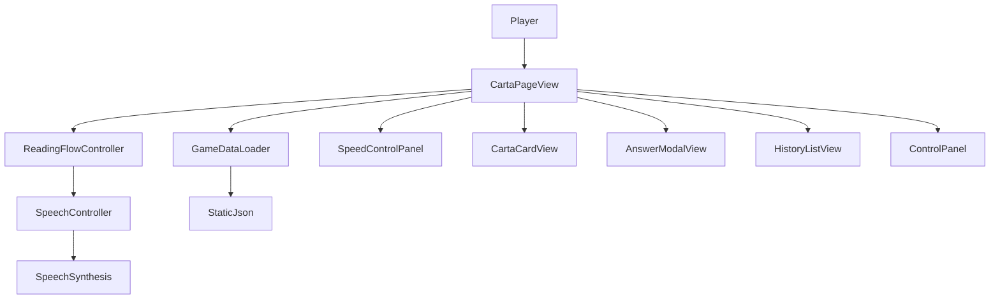
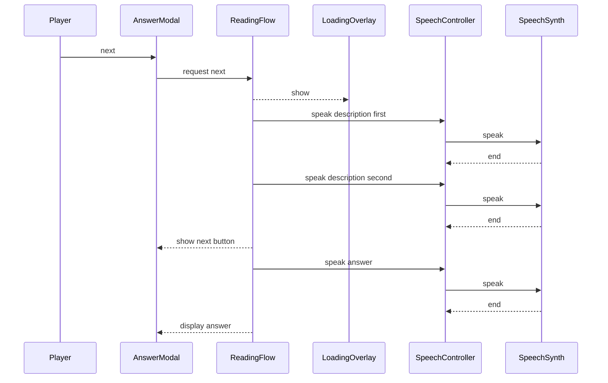

# Technical Design Document

## Overview
本機能は、トップページから広辞苑かるたを選択した際に表示される読み札ページを提供し、ブラウザの読み上げ機能で読み札を代読する。プレイヤーは読み上げ速度を調整しつつ、ランダムに提示される読み札を確認できる。解答はモーダルで提示し、`howtoread_answer` をふりがなとして併記する。読み札本文は 15 文字ごとに改行し、カード高さは 50vh に固定する。

対象ユーザーは二人で広辞苑かるたを遊ぶプレイヤーであり、読み手不在でも進行できることを重視する。読み上げの進行に合わせた文字表示や、縦書きの札 UI による没入感を提供する。

### Goals
- 読み札のランダム提示と全件読み上げを保証する
- Web Speech API を利用した読み上げ制御と進行表示を実現する
- かるた札の縦書き UI で視認性と集中感を高める
- 解答モーダルと次へ操作を統合し、二人プレイのテンポを維持する

### Non-Goals
- 音声認識やユーザー音声入力の対応
- サーバー API や永続ストレージの追加
- 複数ゲームの検索や管理機能の拡張

## Requirements Traceability

| Requirement | Summary | Components | Interfaces | Flows |
|-------------|---------|------------|------------|-------|
| 1.1 | 静的 JSON 取得 | GameDataLoader | GameDataLoaderService | InitialLoad |
| 1.2 | JSON 構造検証 | GameDataLoader | GameDataLoaderService | InitialLoad |
| 1.3 | 読み上げ用フィールド検証 | GameDataLoader | GameDataLoaderService | InitialLoad |
| 1.4 | 取得失敗表示 | GameDataLoader, CartaPageView | GameDataLoaderService | InitialLoad |
| 1.5 | 不正構造の拒否 | GameDataLoader, CartaPageView | GameDataLoaderService | InitialLoad |
| 1.6 | 取得状態表示 | CartaPageView | UI State | InitialLoad |
| 2.1 | 選択済みゲーム表示 | CartaPageView | UI State | InitialLoad |
| 2.2 | 説明文表示 | CartaPageView | UI State | InitialLoad |
| 2.3 | タイトル表示 | CartaPageView | UI State | InitialLoad |
| 2.4 | メタ情報エラー通知 | GameDataLoader, CartaPageView | GameDataLoaderService | InitialLoad |
| 2.5 | 現在ゲーム名表示 | CartaPageView | UI State | InitialLoad |
| 3.1 | 出題順のランダム化 | ReadingFlowController | ReadingFlowService | ReadingCycle |
| 3.2 | 2回読み上げ後の次へ表示 | ReadingFlowController, AnswerModalView | ReadingFlowService | ReadingCycle |
| 3.3 | 次の札選択 | ReadingFlowController, AnswerModalView | ReadingFlowService | ReadingCycle |
| 3.4 | 残札なし終了表示 | ReadingFlowController, CartaPageView | ReadingFlowService | ReadingCycle |
| 3.5 | 完了時リセット表示 | ReadingFlowController, ControlPanel | ReadingFlowService | ReadingCycle |
| 3.6 | 重複なし全件読み上げ | ReadingFlowController | ReadingFlowService | ReadingCycle |
| 3.7 | 進行状況表示 | CartaPageView | UI State | ReadingCycle |
| 4.1 | 3秒後の読み上げ開始 | ReadingFlowController, SpeechController | ReadingFlowService | ReadingCycle |
| 4.2 | 待機中ローディング | LoadingOverlay | UI State | ReadingCycle |
| 4.3 | 2回目読み上げ | ReadingFlowController, SpeechController | ReadingFlowService | ReadingCycle |
| 4.4 | answer 前の10秒待機と読み上げ | ReadingFlowController, SpeechController | ReadingFlowService | ReadingCycle |
| 5.1 | description 表示 | CartaCardView | CardProps | ReadingCycle |
| 5.2 | description 文字送り | CartaCardView, SpeechController | SpeechControllerService | ReadingCycle |
| 5.3 | description 全文表示 | CartaCardView | CardProps | ReadingCycle |
| 5.4 | description 改行表示 | CartaCardView | CardProps | Layout |
| 5.5 | answer モーダル表示 | AnswerModalView | AnswerModalProps | ReadingCycle |
| 5.6 | answer ふりがな表示 | AnswerModalView | AnswerModalProps | ReadingCycle |
| 5.7 | answer 文字送り | AnswerModalView, SpeechController | SpeechControllerService | ReadingCycle |
| 5.8 | answer 全文表示 | AnswerModalView | AnswerModalProps | ReadingCycle |
| 5.9 | 読み札表示保持 | CartaCardView, AnswerModalView | CardProps, AnswerModalProps | ReadingCycle |
| 5.10 | 読み上げ済み履歴表示 | HistoryListView | HistoryListProps | ReadingCycle |
| 5.11 | 履歴全件保持 | HistoryListView | HistoryListProps | ReadingCycle |
| 5.12 | 履歴の直近順表示 | HistoryListView | HistoryListProps | ReadingCycle |
| 5.13 | リスト形式表示 | HistoryListView | HistoryListProps | ReadingCycle |
| 5.14 | モーダル上の次へボタン | AnswerModalView | AnswerModalProps | ReadingCycle |
| 5.15 | 次の札へ切替 | ReadingFlowController, CartaCardView | ReadingFlowService | ReadingCycle |
| 6.1 | 開始で初回札提示 | ControlPanel, ReadingFlowController | ReadingFlowService | ReadingCycle |
| 6.2 | 一時停止 | ControlPanel, ReadingFlowController | ReadingFlowService | ReadingCycle |
| 6.3 | 一時停止中停止 | ReadingFlowController | ReadingFlowService | ReadingCycle |
| 6.4 | 再開 | ControlPanel, ReadingFlowController | ReadingFlowService | ReadingCycle |
| 6.5 | リセット | ControlPanel, ReadingFlowController | ReadingFlowService | ReadingCycle |
| 6.6 | 初期状態復帰 | ReadingFlowController | ReadingFlowService | ReadingCycle |
| 6.7 | トップへ遷移 | ControlPanel, RouterNavigation | Navigation | Navigation |
| 6.8 | 状態表示 | CartaPageView | UI State | ReadingCycle |
| 7.1 | 縦書き表示 | CartaCardView | CardProps | Layout |
| 7.2 | 札 UI 表現 | CartaCardView | CardProps | Layout |
| 7.3 | 中央固定配置 | CartaPageView | LayoutProps | Layout |
| 7.4 | 60-80%占有 | CartaPageView | LayoutProps | Layout |
| 7.5 | 読み札カード高さ50vh | CartaCardView | CardProps | Layout |
| 7.6 | 15文字改行 | CartaCardView | CardProps | Layout |
| 8.1 | 右上スライダー | SpeedControlPanel | SpeedControlProps | SpeedSample |
| 8.2 | サンプル再生ボタン表示 | SpeedControlPanel | SpeedControlProps | SpeedSample |
| 8.3 | サンプル読み上げ | SpeechRateController, SpeechController | SpeechControllerService | SpeedSample |
| 8.4 | スライダー変更時は再生しない | SpeechRateController | State | SpeedSample |
| 8.5 | 読み上げ速度適用 | SpeechRateController, SpeechController | SpeechControllerService | ReadingCycle |

## Architecture

### Existing Architecture Analysis
現状は SPA 前提の最小構成で、サーバーや DB を持たない。データは `assets/data/{gameId}.json` を静的配信し、読み込みと検証はフロントエンドで完結させる。

### Architecture Pattern & Boundary Map



**Architecture Integration**:
- Selected pattern: Feature Scoped Controller による UI とサービス境界の分離
- Domain/feature boundaries: 読み上げ制御、フロー制御、データ取得をそれぞれ独立させる
- Existing patterns preserved: SPA + 静的 JSON 配信
- New components rationale: 読み上げ制御と速度調整、解答モーダルを独立させ、状態遷移を明確化するため
- Steering compliance: React + react-router、静的 JSON 配信、サーバーレス構成

### Technology Stack & Alignment

| Layer | Choice / Version | Role in Feature | Notes |
|-------|------------------|-----------------|-------|
| Frontend / UI | React + react-router | 札 UI と画面遷移 | SPA 前提 |
| Data / Storage | 静的 JSON (`assets/data/{gameId}.json`) | かるたデータ供給 | CDN 配信 |
| Browser API | Web Speech API (SpeechSynthesis) | 読み上げ | SpeechSynthesisUtterance の rate と boundary イベントを利用 |
| Infrastructure / Runtime | Node.js 24+ | 開発ビルド | pnpm 運用 |

## System Flows

### ReadingCycle

ローディングは次の札開始前の 3 秒待機のみ表示し、2回目の読み上げ後の 10 秒待機は表示を伴わない。AnswerModal は2回目の読み上げ完了時点で表示し、answer とふりがなの表示は `howtoread_answer` の読み上げ開始時に開始する。

## Components & Interface Contracts

| Component | Domain/Layer | Intent | Req Coverage | Key Dependencies (P0/P1) | Contracts |
|-----------|--------------|--------|--------------|--------------------------|-----------|
| CartaPageView | UI | 画面構成と表示状態の統合 | 1.6, 2.1-2.5, 3.4, 3.7, 6.8, 7.3-7.4 | ReadingFlowController (P0), GameDataLoader (P0) | State |
| GameDataLoader | Data | JSON 取得と検証 | 1.1-1.5, 2.4 | StaticJson (P0) | Service |
| ReadingFlowController | Logic | 出題順管理と状態遷移 | 3.1-3.6, 4.1, 4.3-4.4, 5.15, 6.1-6.6 | SpeechController (P0), SpeechRateController (P0) | Service, State |
| SpeechController | Integration | 音声読み上げ制御 | 4.1, 4.3-4.4, 5.2, 5.6, 8.3, 8.5 | SpeechSynthesis (P0) | Service |
| SpeechRateController | State | 読み上げ速度の保持 | 8.3-8.5 | SpeechController (P0) | State |
| CartaCardView | UI | 読み札の縦書き表示 | 5.1-5.4, 5.9, 7.1-7.2, 7.5-7.6 | ReadingFlowController (P0) | State |
| AnswerModalView | UI | 解答モーダルと次へ操作 | 3.2-3.3, 5.5-5.9, 5.14 | ReadingFlowController (P0) | State |
| HistoryListView | UI | 読み上げ済み履歴 | 5.10-5.13 | ReadingFlowController (P0) | State |
| ControlPanel | UI | 開始/一時停止/リセット/トップ | 3.5, 6.1-6.2, 6.4-6.7 | ReadingFlowController (P0) | State |
| LoadingOverlay | UI | 読み上げ待機表示 | 4.2 | ReadingFlowController (P1) | State |
| SpeedControlPanel | UI | 速度スライダーとサンプル再生 | 8.1, 8.2 | SpeechRateController (P0) | State |

### UI Contracts

#### AnswerModalView

**Implementation Notes**
- answer の表示は `readingAnswer` 以降のフェーズで開始し、モーダル自体は `waitingAnswer` から表示する
- `howtoread_answer` は answer のふりがなとして同時に表示する
- 次へボタンはモーダル内に配置し、`nextAvailable` が true のときに有効化する

##### Props Interface
```typescript
type AnswerModalProps = {
  isOpen: boolean;
  answerText: string;
  furiganaText: string;
  answerProgress: number;
  furiganaProgress: number;
  nextAvailable: boolean;
  onNext: () => void;
};
```

#### CartaCardView

**Implementation Notes**
- 読み札カードの高さは 50vh を固定する
- `description` は 15 文字ごとに改行し、縦書き表示を維持する

### Data / Integration

#### GameDataLoader

| Field | Detail |
|-------|--------|
| Intent | 静的 JSON を取得し、`meta` と `items` を検証する |
| Requirements | 1.1, 1.2, 1.3, 1.4, 1.5, 2.4 |

**Responsibilities & Constraints**
- `assets/data/{gameId}.json` から取得する
- `meta` と `items` が存在し、`description`/`answer` と読み上げ用フィールドの欠落がないことを保証する

**Dependencies**
- Outbound: StaticJson — 静的 JSON 取得 (P0)
- Inbound: CartaPageView — 読み込み要求 (P0)

**Contracts**: Service [x] / API [ ] / Event [ ] / Batch [ ] / State [ ]

##### Service Interface
```typescript
type GameId = string;

type GameMeta = {
  title: string;
  description: string;
};

type CartaItem = {
  description: string;
  answer: string;
  howtoread_description: string;
  howtoread_answer: string;
};

type CartaData = {
  meta: GameMeta;
  items: CartaItem[];
};

type DataLoadError =
  | { type: "network"; message: string }
  | { type: "invalidFormat"; message: string }
  | { type: "notFound"; message: string };

type Result<T, E> = { ok: true; value: T } | { ok: false; error: E };

interface GameDataLoaderService {
  loadGameData(gameId: GameId): Promise<Result<CartaData, DataLoadError>>;
}
```
- Preconditions: gameId はケバブケース
- Postconditions: `meta` と `items` が揃ったデータのみ返却
- Invariants: 取得失敗時は `ok: false` を返す

**Implementation Notes**
- Integration: Fetch API で静的 JSON を取得
- Validation: `meta` と `items` の存在と型を検証
- Risks: JSON 形式の揺れに備えてエラーメッセージを明確化

### Application / Logic

#### ReadingFlowController

| Field | Detail |
|-------|--------|
| Intent | 読み上げ順序とタイマー、状態遷移を管理する |
| Requirements | 3.1-3.6, 4.1, 4.3-4.4, 5.15, 6.1-6.6 |

**Responsibilities & Constraints**
- 札のランダム順序と残数管理を行う
- 3 秒待機と 10 秒待機を含む読み上げ 2 回 + answer 1 回の遷移を保証する
- 2回目の読み上げ完了時点で answer モーダルと次へ操作を有効化する
- 読み上げは `howtoread_description`/`howtoread_answer` を使用し、表示は `description`/`answer` を使用する
- 完了時に次へ/リセット表示を切り替える

**Dependencies**
- Inbound: ControlPanel — 進行操作 (P0)
- Outbound: SpeechController — 読み上げ実行 (P0)
- Outbound: SpeechRateController — 速度取得 (P0)

**Contracts**: Service [x] / API [ ] / Event [ ] / Batch [ ] / State [x]

##### Service Interface
```typescript
type ReadingPhase =
  | "idle"
  | "loading"
  | "readingDescriptionFirst"
  | "readingDescriptionSecond"
  | "waitingAnswer"
  | "readingAnswer"
  | "paused"
  | "finished";

type ReadingStatus = {
  phase: ReadingPhase;
  currentIndex: number | null;
  remainingCount: number;
  nextAvailable: boolean;
};

type FlowError =
  | { type: "invalidState"; message: string }
  | { type: "noRemaining"; message: string };

type ReadingStep = {
  item: CartaItem;
  orderIndex: number;
};

type FlowTransition = {
  status: ReadingStatus;
  nextAction: "showNext" | "showReset" | "continue";
};

interface ReadingFlowService {
  startSession(data: CartaData): Result<ReadingStatus, FlowError>;
  requestNext(): Result<ReadingStep, FlowError>;
  notifySpeechEnd(kind: "descriptionFirst" | "descriptionSecond" | "answer"): Result<FlowTransition, FlowError>;
  pause(): ReadingStatus;
  reset(): ReadingStatus;
}
```
- Preconditions: startSession は data 検証済み
- Postconditions: requestNext は未出題札のみ返却
- Invariants: 札は重複せず、全件読み上げで finished に遷移

**Implementation Notes**
- Integration: SpeechController の終了イベントを受けて状態遷移
- Validation: 残り枚数ゼロ時は noRemaining を返す
- Risks: タイマー中断時の状態破綻に注意

#### SpeechController

| Field | Detail |
|-------|--------|
| Intent | Web Speech API を利用して読み上げを実行する |
| Requirements | 4.1, 4.3, 4.4, 5.2, 5.6, 8.2, 8.3 |

**Responsibilities & Constraints**
- `speechSynthesis.speak()` を呼び出し読み上げを実行する
- `boundary` と `end` イベントで進行と完了を通知する
- rate を SpeechRateController から受け取る

**Dependencies**
- External: SpeechSynthesis — ブラウザ音声読み上げ (P0)
- Inbound: ReadingFlowController — 読み上げ指示 (P0)
- Inbound: SpeechRateController — rate 設定 (P0)

**Contracts**: Service [x] / API [ ] / Event [ ] / Batch [ ] / State [ ]

##### Service Interface
```typescript
type SpeechBoundary = { charIndex: number };

type SpeechError =
  | { type: "unsupported"; message: string }
  | { type: "synthesisError"; message: string }
  | { type: "canceled"; message: string };

type SpeechRequest = {
  text: string;
  rate: number;
  onBoundary: (boundary: SpeechBoundary) => void;
  onEnd: () => void;
  onError: (error: SpeechError) => void;
};

type SpeechPlayback = {
  text: string;
};

interface SpeechControllerService {
  speak(request: SpeechRequest): Promise<Result<SpeechPlayback, SpeechError>>;
  cancel(): void;
}
```
- Preconditions: text は空文字でない
- Postconditions: onEnd が完了通知を返す
- Invariants: 進行中に cancel が呼ばれた場合は error を返す

**Implementation Notes**
- Integration: SpeechSynthesisUtterance の `rate` をスライダー値で設定
- Validation: SpeechSynthesis が存在しない場合は unsupported を返す
- Risks: ブラウザ互換性差に備えたフォールバック表示

#### SpeechRateController

| Field | Detail |
|-------|--------|
| Intent | 読み上げ速度の設定と共有 | 
| Requirements | 8.3, 8.4, 8.5 |

**Responsibilities & Constraints**
- スライダーの設定値を保持し、読み上げ時に供給する
- サンプル再生はボタン操作でのみトリガーする
- スライダー変更ではサンプル読み上げを実行しない

**Dependencies**
- Inbound: SpeedControlPanel — 速度変更 (P0)
- Outbound: SpeechController — サンプル読み上げ (P0)

**Contracts**: Service [ ] / API [ ] / Event [ ] / Batch [ ] / State [x]

##### State Management
- State model:
  - `rate`: number
  - `sampleText`: "ふるいけやかわずとびこむなつのおと"
- Persistence & consistency: ページ内のみ保持
- Concurrency strategy: 変更時に最新値を優先

**Implementation Notes**
- Integration: サンプル再生ボタン操作時に SpeechController を呼び出す
- Validation: rate の範囲を UI 上で制約
- Risks: サンプル読み上げと本読み上げの競合を cancel で抑制

## Data Models

### Domain Model
- **GameMeta**: ゲームの表示情報（title, description）
- **CartaItem**: 読み札の本文と読み上げテキスト（description, answer, howtoread_description, howtoread_answer）。`howtoread_answer` は answer のふりがな表示にも利用する
- **ReadingSession**: 読み上げ順序、現在位置、残数、次へ可能フラグ、状態を保持

### Logical Data Model
- `CartaData` は `meta` と `items` のみを持つ
- `items` は description と answer と読み上げ用フィールドの双方を必須とする
- 読み上げ順序はセッション内で一意

## Error Handling

### Error Strategy
読み上げ機能やデータ取得の失敗は UI に明示し、進行を停止する。復帰はリセット操作に集約する。

### Error Categories and Responses
- **User Errors**: なし（入力を受けない）
- **System Errors**: SpeechSynthesis 非対応 → メッセージ表示と読み上げ機能停止
- **Business Logic Errors**: JSON 形式不正 → 開始禁止と理由表示

### Monitoring
読み上げエラーはコンソールログと UI メッセージで通知する。

## Testing Strategy

### Unit Tests
- 札のランダム順序が重複しないこと
- 3 秒待機と 10 秒待機の状態遷移
- howtoread_description 2回 + howtoread_answer 1回の読み上げ順序
- 読み上げ速度が rate に反映されること
- 2回目読み上げ後に nextAvailable が true になること

### Integration Tests
- データ取得から初期説明読み上げまでの一連の流れ
- 次へボタンの表示と読み上げ進行
- リセットで初期状態に戻ること
- answer モーダルで次へ操作が行えること

### E2E/UI Tests
- 札 UI が縦書きで中央配置され、カード高さが 50vh であること
- 読み上げ中の文字送りと完了後の全文表示
- 速度スライダー変更でサンプルが再生されないこと
- サンプル再生ボタン押下時の読み上げ
- description が 15 文字ごとに改行されること
- answer とふりがながモーダル表示され、次へボタンがモーダル内に表示されること

## Performance & Scalability

### Feature-Specific Targets
- 読み上げ待機中のローディング表示は 100ms 以内に反映
- 読み上げ済み履歴は全件表示でもレイアウト崩れがないこと

## Supporting References
- Web Speech API の詳細は `research.md` を参照
